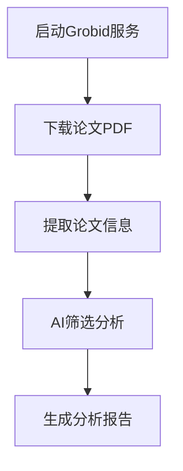
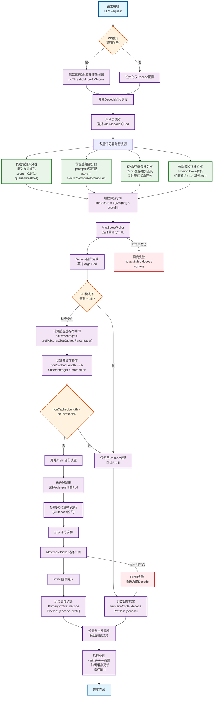

# Paper-Analysis 论文分析工具集

> 🎯 一个功能完整的学术论文自动化分析工具集，提供从论文下载、内容提取到AI加速研究论文筛选的完整解决方案。

[](https://www.python.org/)
[](LICENSE)
[](http://grobid.readthedocs.io/)

---

## 📖 目录

- [🚨 重要提醒](#-重要提醒)
- [⚡ 快速开始](#-快速开始)
- [🛠️ 环境配置](#️-环境配置)
- [🚀 功能介绍](#-功能介绍)
- [📋 使用指南](#-使用指南)
- [⚙️ 配置说明](#️-配置说明)
- [❓ 常见问题](#-常见问题)
- [📁 项目结构](#-项目结构)
- [🤝 贡献指南](#-贡献指南)

---

## 🚨 重要提醒

> ⚠️ **必读**：本项目运行时**必须依赖Grobid本地服务器**进行PDF文件的文本提取和结构化分析。

**Grobid是什么？**
- 一个开源的机器学习库，专门用于从学术文档中提取结构化信息
- 能够从PDF中准确提取论文标题、摘要、作者、参考文献等信息
- 本项目的核心功能都依赖于Grobid服务

---

## ⚡ 快速开始

### 3分钟快速体验

1. **安装Python依赖**
   ```bash
   pip install -r requirements.txt
   ```

2. **启动Grobid服务器**
   ```bash
   # 使用Docker一键启动（推荐）
   docker run --rm -it -p 8070:8070 lfoppiano/grobid:latest-crf
   ```

3. **验证环境**
   ```bash
   # 检查Grobid服务状态
   curl http://localhost:8070
   ```

4. **开始使用**
   ```bash
   cd AAAI-2025
   python download_papers.py  # 下载论文
   python get_ai_inference_related_paper.py  # 分析论文
   ```

---

## 🛠️ 环境配置

### 系统要求

| 组件 | 要求 | 说明 |
|------|------|------|
| Python | 3.7+ | 建议使用3.8或更高版本 |
| 内存 | 4GB+ | Grobid处理大文件需要足够内存 |
| 磁盘 | 10GB+ | 存储下载的论文和分析结果 |
| 网络 | 稳定连接 | 下载论文和Docker镜像 |

### Windows用户必看

> 💻 **Windows用户需要额外准备WSL2和Docker Desktop**

<details>
<summary>📋 点击展开Windows详细配置步骤</summary>

#### 步骤1：安装WSL2
```powershell
# 管理员权限PowerShell中执行
wsl --install
```

#### 步骤2：安装Docker Desktop
1. 下载：[Docker Desktop for Windows](https://www.docker.com/products/docker-desktop/)
2. 安装时勾选 "Use WSL 2 based engine"
3. 重启计算机

#### 步骤3：验证安装
```bash
docker --version
docker run hello-world
```

#### 常见问题
- **虚拟化未启用**：进入BIOS启用虚拟化功能
- **WSL2版本错误**：运行 `wsl --set-default-version 2`
- **权限问题**：确保用户在docker-users组中

</details>

### Linux/Mac用户

```bash
# 安装Docker（以Ubuntu为例）
sudo apt update
sudo apt install docker.io
sudo systemctl start docker
sudo systemctl enable docker

# 将用户添加到docker组（避免sudo）
sudo usermod -aG docker $USER
```

---

## 🚀 功能介绍

### 核心功能模块

| 模块 | 功能 | 主要特性 |
|------|------|----------|
| 📥 **PDF下载器** | 批量下载学术论文 | • 智能重试<br>• 断点续传<br>• 自动命名 |
| 📄 **内容提取器** | 解析PDF结构信息 | • 基于Grobid<br>• 缓存机制<br>• 高准确度 |
| 🤖 **AI论文筛选** | 筛选AI加速相关论文 | • 关键词匹配<br>• 智能评分<br>• 批量处理 |
| 📚 **AAAI工具** | AAAI 2025专项分析 | • 会议论文<br>• Oral筛选<br>• 分类统计 |

### 应用场景

- **🔬 学术研究**：快速收集和分析特定领域的论文
- **📊 文献综述**：自动化的文献筛选和分类
- **🏢 企业调研**：跟踪行业技术发展趋势
- **👨‍🎓 教学辅助**：为课程准备相关论文资料

---

## 📋 使用指南

### 基础使用流程



### 详细步骤

#### 1️⃣ 启动Grobid服务

```bash
# 方式1：使用Docker（推荐）
docker run --rm -it -p 8070:8070 lfoppiano/grobid:0.8.3

# 方式2：后台运行
docker run -d --name grobid -p 8070:8070 lfoppiano/grobid:0.8.3

# 验证服务
curl http://localhost:8070  # Linux/Mac
# 或浏览器访问 http://localhost:8070
```

#### 2️⃣ 下载AAAI 2025论文

```bash
cd AAAI-2025
python download_papers.py
```

**预期输出：**
```
📥 开始下载AAAI 2025论文...
🔍 解析论文列表...
📄 找到 1,234 篇论文
⬇️  开始下载: [1/1234] Deep Learning for...
✅ 下载完成！成功: 1,234, 失败: 0
```

#### 3️⃣ 筛选AI加速相关论文

```bash
python get_ai_inference_related_paper.py
```

**输出文件：**
- `ai_inference_related_papers.csv` - 筛选结果详表
- `match_statistics.csv` - 匹配统计信息
- `ai_inference_related_papers.txt` - 可读性报告

### 高级用法示例

#### 自定义论文下载

```python
from utils.pdf_downloader import download_pdfs

# 下载指定论文
pdf_list = [
    {"url": "https://example.com/paper1.pdf", "title": "深度学习论文"},
    {"url": "https://example.com/paper2.pdf", "title": "机器学习论文"}
]

results = download_pdfs(pdf_list, save_dir="my_papers", delay=2.0)
print(f"✅ 成功: {results['success']}, ❌ 失败: {results['failed']}")
```

#### 单独提取论文信息

```python
from utils.pdf_extractor import extract_paper_abstract

# 提取论文信息
paper_info = extract_paper_abstract("path/to/paper.pdf")
print(f"📖 标题: {paper_info['title']}")
print(f"📝 摘要: {paper_info['abstract'][:200]}...")
print(f"👥 作者: {', '.join(paper_info['authors'])}")
```

---

## ⚙️ 配置说明

### Grobid服务配置

编辑 `utils/pdf_extractor/config.json`：

```json
{
    "grobid_server": "http://127.0.0.1:8070",
    "batch_size": 100,
    "sleep_time": 5,
    "timeout": 60,
    "coordinates": ["persName", "figure", "ref", "biblStruct", "formula", "s", "note", "title"]
}
```

### 下载器配置

编辑 `AAAI-2025/config.py`：

```python
# 基本配置
DEFAULT_SAVE_DIR = "AAAI-2025-Papers"  # 保存目录
DEFAULT_DELAY = 1.5                    # 下载间隔(秒)
MAX_DOWNLOADS = None                   # 限制数量(None=全部)

# 网络配置
REQUEST_TIMEOUT = 30                   # 超时时间
MAX_RETRY_ATTEMPTS = 5                 # 重试次数
```

### 筛选关键词配置

AI论文筛选支持自定义关键词，可在 `utils/ai_acceleration_extractor/` 中修改匹配规则。

---

## ❓ 常见问题

### 🔧 环境问题

<details>
<summary><strong>Q: Grobid连接失败怎么办？</strong></summary>

**A: 请按以下步骤排查：**

1. **检查服务状态**
   ```bash
   docker ps  # 查看Grobid容器是否运行
   ```

2. **重启服务**
   ```bash
   docker stop grobid  # 如果已运行
   docker run --rm -it -p 8070:8070 lfoppiano/grobid:0.8.3
   ```

3. **检查端口占用**
   ```bash
   # Windows
   netstat -ano | findstr :8070
   # Linux/Mac
   lsof -i :8070
   ```

</details>

<details>
<summary><strong>Q: Windows下Docker无法启动？</strong></summary>

**A: 常见解决方案：**

1. **检查WSL2**
   ```powershell
   wsl --list --verbose  # 确认WSL2已安装
   ```

2. **检查虚拟化**
   - 重启电脑进入BIOS
   - 启用 Intel VT-x 或 AMD-V

3. **重置Docker**
   - 右键Docker Desktop图标
   - 选择 "Reset to factory defaults"

</details>

### 📥 下载问题

<details>
<summary><strong>Q: 论文下载很慢或失败？</strong></summary>

**A: 优化建议：**

1. **调整下载间隔**
   ```python
   # 在config.py中
   DEFAULT_DELAY = 3.0  # 增加到3秒
   ```

2. **设置下载限制**
   ```python
   MAX_DOWNLOADS = 50  # 先下载50篇测试
   ```

3. **检查网络**
   - 确保网络连接稳定
   - 考虑使用代理或VPN

</details>

### 🤖 分析问题

<details>
<summary><strong>Q: AI论文筛选结果为空？</strong></summary>

**A: 可能原因：**

1. **关键词匹配过严**：检查关键词配置
2. **PDF提取失败**：确认Grobid服务正常
3. **文件路径错误**：检查论文文件夹路径

</details>

---

## 📁 项目结构

```
Paper-Analysis/
├── 📄 README.md                       # 📖 项目说明文档
├── 📄 requirements.txt               # 📦 Python依赖列表  
├── 📄 LICENSE                        # ⚖️ 许可证文件
├── 📄 .gitignore                     # 🚫 Git忽略配置
├── 📂 utils/                         # 🛠️ 核心工具模块
│   ├── 📄 __init__.py
│   ├── 📄 utils.py                   # 🔧 通用工具函数
│   ├── 📂 pdf_downloader/            # ⬇️ PDF下载器
│   │   ├── 📄 pdf_downloader.py      # 核心下载逻辑
│   │   └── 📄 example_usage.py       # 使用示例
│   ├── 📂 pdf_extractor/             # 📄 PDF内容提取器  
│   │   ├── 📄 pdf_extractor.py       # Grobid集成
│   │   └── 📄 config.json           # Grobid配置
│   └── 📂 ai_acceleration_extractor/ # 🤖 AI论文筛选器
│       └── 📄 ai_acceleration_extractor.py
├── 📂 AAAI-2025/                     # 📚 AAAI专项工具
│   ├── 📄 README.md                  # AAAI工具说明
│   ├── 📄 config.py                  # 下载配置
│   ├── 📄 download_papers.py         # 论文下载脚本
│   ├── 📄 get_ai_inference_related_paper.py  # AI论文筛选
│   └── 📂 AAAI-2025-Papers/          # 📁 论文存储目录
└── 📂 test_output/                   # 🧪 测试输出目录
```

---

## 🤝 贡献指南

### 如何贡献

1. **🍴 Fork** 本项目
2. **🌿 创建** 特性分支 (`git checkout -b feature/AmazingFeature`)
3. **💾 提交** 更改 (`git commit -m 'Add some AmazingFeature'`)
4. **📤 推送** 到分支 (`git push origin feature/AmazingFeature`)
5. **📮 提交** Pull Request

### 开发环境

```bash
# 克隆项目
git clone https://github.com/your-username/Paper-Analysis.git
cd Paper-Analysis

# 安装开发依赖
pip install -r requirements.txt

# 启动Grobid（开发时需要）
docker run --rm -it -p 8070:8070 lfoppiano/grobid:0.8.3
```

### 报告问题

- 🐛 **Bug报告**：使用 [Issue](../../issues) 模板
- 💡 **功能建议**：详细描述需求和使用场景
- 📖 **文档改进**：欢迎提出文档优化建议

---

## 📄 许可证

本项目采用开源许可证，详见 [LICENSE](LICENSE) 文件。

---

## 🔗 相关链接

- **Grobid官网**：https://grobid.readthedocs.io/
- **Docker官网**：https://www.docker.com/
- **WSL2文档**：https://docs.microsoft.com/en-us/windows/wsl/

---

<div align="center">

**⚠️ 最后提醒：使用前请确保Grobid本地服务器已正确启动！**

🌟 **如果这个项目对您有帮助，请给我们一个Star！** 🌟

</div>


